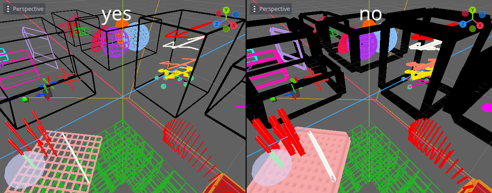

# Double Precision

[Godot Docs - Large world coordinates](https://docs.godotengine.org/en/latest/tutorials/physics/large_world_coordinates.html)

This library supports building with `precision=double`, but does not provide pre-compiled binaries, as does Godot itself.

Before building with double precision, it is recommended to read the [Build](Build.md) tips.

## Compilation flags

By default, you can simply run scons with the desired platform and the `precision=double` flag:

```python
scons platform=windows target=editor arch=x86_64 precision=double
```

But there are also a few additional flags that can affect the visual representation of meshes.

@note
The videos were captured at the position `Vector3(16_000_000, 0, 0)`.

### `fix_precision_enabled=yes|no` (default: yes)

This flag enables a hack that moves the centers of all multimesh to the camera position if the camera has moved too far away. If this flag is disabled, then all meshes will always be drawn relative to the center of the world.

Enabling or disabling the `fix_precision_enabled` flag only affects if `precision=double` is enabled.

\htmlonly
<video width="100%" autoplay loop muted>
  <source src="fix_precision_enabled.webm" type="video/webm">
  There should be a <a href="fix_precision_enabled.webm">video</a> here, but your browser does not support WebM VP9 video.
</video>
\endhtmlonly

### `shader_world_coords_enabled=yes|no` (default: yes)

This flag changes how meshes using world coordinates will be displayed. This category includes all volumetric objects. Wireframe meshes are not affected by this flag.

`shader_world_coords_enabled` flag can be toggled independently of `precision=double`.

\htmlonly
<video width="100%" autoplay loop muted>
  <source src="shader_world_coords_enabled.webm" type="video/webm">
  There should be a <a href="shader_world_coords_enabled.webm">video</a> here, but your browser does not support WebM VP9 video.
</video>
\endhtmlonly

But enabling world coordinates allows normalization of volumetric meshes within `float` precision.



## Examples

```python
# Disable world coordinates for shaders and enable position fix:
scons platform=windows target=editor arch=x86_64 precision=double shader_world_coords_enabled=no fix_precision_enabled=yes

# Leave the world coordinates enabled and disable the position fix::
scons platform=windows target=editor arch=x86_64 precision=double fix_precision_enabled=no
```
