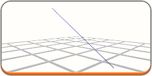
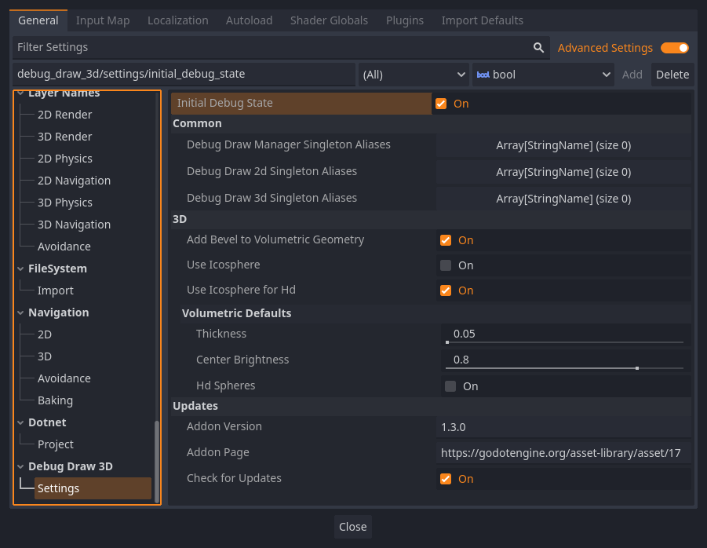

# Examples

More examples can be found in the `examples_dd3d/` folder.

Simple test:

```python
func _process(delta: float) -> void:
    var _time = Time.get_ticks_msec() / 1000.0
    var box_pos = Vector3(0, sin(_time * 4), 0)
    var line_begin = Vector3(-1, sin(_time * 4), 0)
    var line_end = Vector3(1, cos(_time * 4), 0)

    DebugDraw3D.draw_box(box_pos, Vector3(1, 2, 1), Color(0, 1, 0))
    DebugDraw3D.draw_line(line_begin, line_end, Color(1, 1, 0))
    DebugDraw2D.set_text("Time", _time)
    DebugDraw2D.set_text("Frames drawn", Engine.get_frames_drawn())
    DebugDraw2D.set_text("FPS", Engine.get_frames_per_second())
    DebugDraw2D.set_text("delta", delta)
```

## CSharp

When you start the engine for the first time, bindings for `C#` will be generated automatically. If this does not happen, you can manually generate them through the `Project - Tools - Debug Draw` menu.


```csharp
public override void _Process(float delta)
{
    var _time = Time.GetTicksMsec() / 1000.0f;
    var box_pos = new Vector3(0, Mathf.Sin(_time * 4f), 0);
    var line_begin = new Vector3(-1, Mathf.Sin(_time * 4f), 0);
    var line_end = new Vector3(1, Mathf.Cos(_time * 4f), 0);

    DebugDraw3D.DrawBox(box_pos, new Vector3(1, 2, 1), new Color(0, 1, 0));
    DebugDraw3D.DrawLine(line_begin, line_end, new Color(1, 1, 0));
    DebugDraw2D.SetText("Time", _time);
    DebugDraw2D.SetText("Frames drawn", Engine.GetFramesDrawn());
    DebugDraw2D.SetText("FPS", Engine.GetFramesPerSecond());
    DebugDraw2D.SetText("delta", delta);
}
```

@warning
C# bindings work using ClassDB, which greatly decreases its performance and it can run slower than GDScript. There is currently no way to fix this.

## Aliases

If you don't want to write `DebugDraw3D`/`DebugDraw2D` every time, so you can use aliases for these singletons.

```python
var _s = Dbg3.new_scope_config().set_thickness(0.025).set_center_brightness(0.7)
Dbg3.draw_grid_xf(%Grid.global_transform, Vector2i(10,10), Color.LIGHT_GRAY)
Dbg2.set_text("Frametime", delta)
```

There is more information in the description of DebugDrawManager.

## Scope configs

When using DebugDraw3D, you will probably want to use the scope configurations DebugDraw3DScopeConfig. With this class you will be able to change the thickness of the geometry, the brightness of the volumetric shapes, the density of the sphere mesh and possibly other parameters in the future.



## Project Settings

You can also explore other project settings in `debug_draw_3d/settings`.


