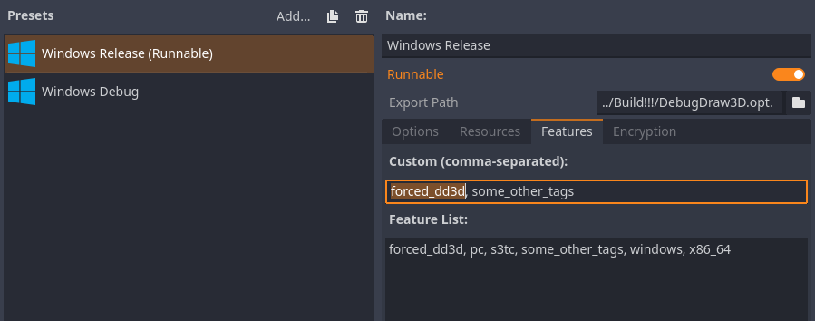
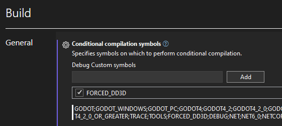

# Exporting a project

Most likely, when exporting a release version of a game, you don't want to export the debug library along with it. But since there is still no `Conditional Compilation` in `GDScript`, so I decided to create a `dummy` library that has the same API as a regular library, but has minimal impact on performance, even if calls to its methods occur. The `dummy` library is used by default in the release version.

However if you need to use debug rendering in the release version, then you can add the `forced_dd3d` feature when exporting. In this case, the release library with all the functionality will be used.

In C#, these tags are not taken into account at compile time, so the Release build will use Runtime checks to disable draw calls. If you want to avoid this, you can manually specify the `FORCED_DD3D` symbol.

@note
Though it's still best that these calls don't happen at all.
In the future, it is possible that the dependency on the native library in the release version will be removed and replaced by dummy GDScript.
